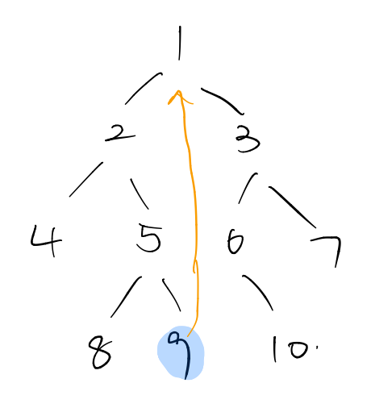

## 题目描述

给定一个二叉树和其中的一个结点，请找出中序遍历顺序的下一个结点并且返回。注意，树中的结点不仅包含左右子结点，同时包含指向父结点的指针。

## 解题思路

### 思路一

这道题牛客上给出的预先设定好的数据结构中，树的指针多了一个next指针，指向当前节点的父节点。

* 当前节点有右子树的时候，中序遍历序列中，其下一个结点就是它右子树的中序遍历的第一个节点。

* 当前节点没有右子树：

  * 当前节点没有父节点时，那么该节点就是最后一个节点，返回nullptr。

  * 当前节点是其父节点的左儿子，那么下一个结点就是就是其父节点。

  * 当前节点是其父节点的右儿子，那么下一个结点应该是从该节点不断地找父节点，直到当前节点是其父节点的左子树时，那么下一个结点就是当前节点的父节点。如下图所示，9的下一个结点是2的父节点，也就是1。

    

```cpp
/*
struct TreeLinkNode {
    int val;
    struct TreeLinkNode *left;
    struct TreeLinkNode *right;
    struct TreeLinkNode *next;
    TreeLinkNode(int x) :val(x), left(NULL), right(NULL), next(NULL) {
        
    }
};
*/
class Solution {
public:
    TreeLinkNode* GetNext(TreeLinkNode* pNode)
    {
        // 如果该节点右子树非空  那么下一个节点是该右子树的中序遍历的第一个节点，
        // 如果该节点的右子树是非空的 那么就有两种情况: (1)该节点是其父节点的左儿子,此时下一个结点就是其父节点
        //                                       (2)该节点是其父节点的有儿子，。。。
        if(pNode==nullptr) return nullptr;
        if(pNode->right != nullptr){// 当前节点有右子树
            TreeLinkNode *cur = pNode->right;
            while(cur->left){
                cur = cur->left;
            }
            return cur;
        }
        // 当前节点没有右子树
        if(pNode->next==nullptr) return nullptr;// 当前节点没有父节点
        // 将当前指针往上移动  直到其为某个节点的左子树
        TreeLinkNode *cur = pNode;
        while(cur->next){
            if(cur->next->left == cur) break;
            cur = cur->next;
        }
        return cur->next;
    }
};
```

