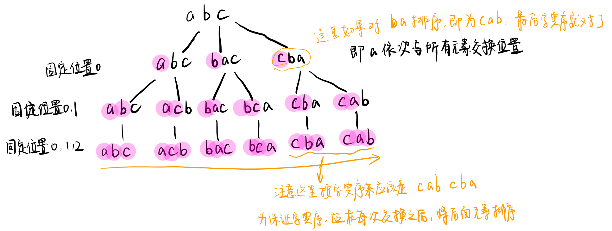
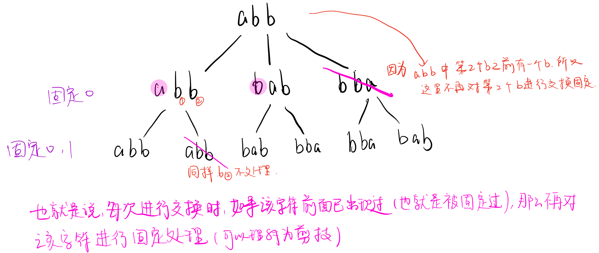

## 题目描述

输入一个字符串,按字典序打印出该字符串中字符的所有排列。例如输入字符串abc,则打印出由字符a,b,c所能排列出来的所有字符串abc,acb,bac,bca,cab和cba。 

输入描述：

> 输入一个字符串,长度不超过9(可能有字符重复),字符只包括大小写字母。

## 解题思路

这是一道典型的**全排列**问题。

注意几个点：

1. 所有字符串需要按字典序排列；
2. 要处理字符重复情况

### 思路一

如果不考虑重复字符情况，假设要求 "bac"的全排列的所有可能情况，可以想到的思路是：

`先固定第一个位置的字符，求剩下字符的的全排列组合`

示意图如下：



显然这里可以通过递归来实现。

从图中可以看出，要得到最后字典序的结果，必须在每次固定位置时(交换操作后)，将新固定的位置之后的所有字符串进行排序。

另一个要处理的情况就是当有重复字符时的情况：



即：`每个数分别与它后面非重复出现的数字交换`

代码如下：

```cpp
class Solution {
public:
    vector<string> Permutation(string str) {
        // 返回字符串的所有全排列
        if(str=="") return {};
        vector<string> res;
        sort(str.begin(), str.end()); //排序
        dfs(res, str, 0);
        return res;
    }
    void dfs(vector<string> &res, string cur, int index){
        if(index==cur.size()){
            res.push_back(cur);
            return;
        }
        for(int i=index; i<cur.size(); i++){//固定index处的元素
            if(i==index || cur[i]!=cur[index]){
                swap(cur[index], cur[i]);
                sort(cur.begin()+index+1, cur.end());
                dfs(res, cur, index+1);
                swap(cur[index], cur[i]);
            }
        }
    }
};
```

### 思路二

上面是递归的思路，如果要使用非递归思路求解，其实就是求一个`字典序问题`。

```
什么是字典序问题？

例：要求出由数字1、2、3、4、5组成的所有数，并且要按递增的顺序。

解法：
很容易知道，最小的数是 12345，那么下一个数是多少呢？
```

对字典序问题，要求下一个排列数，思路是：


如上图所示，从当前排列数【158476531为例】的最后一个数字出发，向左遍历，找到第一个减小位置的数4，从该数开始向后，找到第一个小于4的数，也就是3，找到最后一个大于4和数也就是5，将4和5进行交换，然后将5(新位置)也就是原来的4后的所有数字按从小到大排列。

```cpp
class Solution {
public:
    vector<string> Permutation(string str) {
        if(str=="") return {};
        vector<string> res;
        sort(str.begin(), str.end());
        res.push_back(str);
        int p=0, q=0;
        while(true){
            p = str.size()-1;
            while(p>0 && str[p]<=str[p-1]) p--;// 注意这里是小于等于 1123422
            if(p==0) return res;
            //p位置是第一个递减位置
            p--;
            q = p+1;
            while(q<str.size() && str[q]>str[p]) q++;
            q--;
            swap(str[q], str[p]);
            sort(str.begin()+p+1, str.end());
            res.push_back(str);
        }
    }
};
```

写上面这一段代码的时候一直出错，有时间一定要多写几遍！！！！！！多理解！！！

