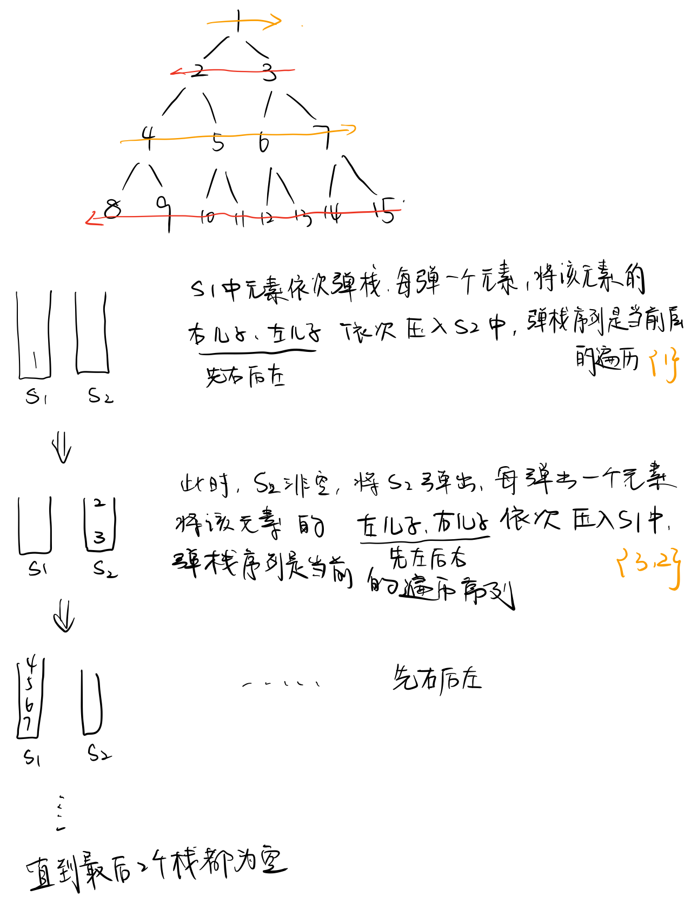

## 题目描述

请实现一个函数按照之字形打印二叉树，即第一行按照从左到右的顺序打印，第二层按照从右至左的顺序打印，第三行按照从左到右的顺序打印，其他行以此类推。

## 解题思路

### 思路一

使用两个栈s1, s2来辅助实现。初始化将第一行的数据（根节点）压入s1中。具体见下图：



代码：

```cpp
/*
struct TreeNode {
    int val;
    struct TreeNode *left;
    struct TreeNode *right;
    TreeNode(int x) :
            val(x), left(NULL), right(NULL) {
    }
};
*/
class Solution {
public:
    vector<vector<int> > Print(TreeNode* pRoot) {
        // 按照Z字形打印二叉树
        stack<TreeNode *> s1, s2;
        vector<vector<int>> res;
        if(pRoot==nullptr) return res;
        TreeNode *root = pRoot;
        s1.push(root);
        while(!s1.empty() || !s2.empty()){
            vector<int> cur;
            TreeNode *ptr=nullptr;;
            if(s2.empty()){// 从s1中取 先左节点然后是右节点 放进s2中
                while(!s1.empty()){
                    ptr = s1.top();
                    cur.push_back(ptr->val);
                    if(ptr->left) s2.push(ptr->left);
                    if(ptr->right) s2.push(ptr->right);
                    s1.pop();
                }
            }
            else{
                while(!s2.empty()){
                    ptr = s2.top();
                    cur.push_back(ptr->val);
                    if(ptr->right) s1.push(ptr->right);
                    if(ptr->left) s1.push(ptr->left);
                    s2.pop();
                }
            }
            res.push_back(cur);
        }
        return res;
    }
    
};
```

