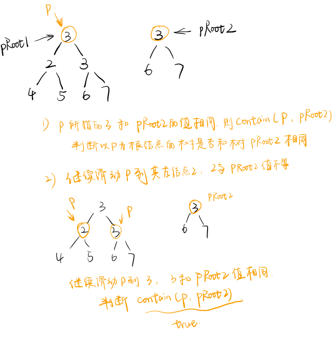

## 题目描述

输入两棵二叉树A，B，判断B是不是A的子结构。（ps：我们约定空树不是任意一个树的子结构） 

## 解题思路



### 思路一

要判断树2是否为树1的子结构，也就是说树2中的结点值+结构能和树1的某部分“重合”。

用一个指针在树1上滑动，如果找到某个结点树2的根结点相同，那么判断树1中以该结点为根节点的子树是否包含树2。如果不包含，那么判断树2是否为该节点左子树的子结构或右子树的子结构。

```cpp
/*
struct TreeNode {
	int val;
	struct TreeNode *left;
	struct TreeNode *right;
	TreeNode(int x) :
			val(x), left(NULL), right(NULL) {
	}
};*/
class Solution {
public:
    bool HasSubtree(TreeNode* pRoot1, TreeNode* pRoot2)// 判断pRoot2是否为pRoot1的子结构
    {
        if(pRoot2==nullptr || pRoot1==nullptr) return false;
        if(pRoot1->val==pRoot2->val && contain(pRoot1, pRoot2)) return true;
        else return HasSubtree(pRoot1->left, pRoot2) || HasSubtree(pRoot1->right, pRoot2);
    }
    bool contain(TreeNode *p1, TreeNode *p2){
        if(p2==nullptr) return true;
        if(p1==nullptr) return false;
        if(p1->val != p2->val) return false;
        return contain(p1->left, p2->left) && contain(p1->right, p2->right);
    }
};
```

