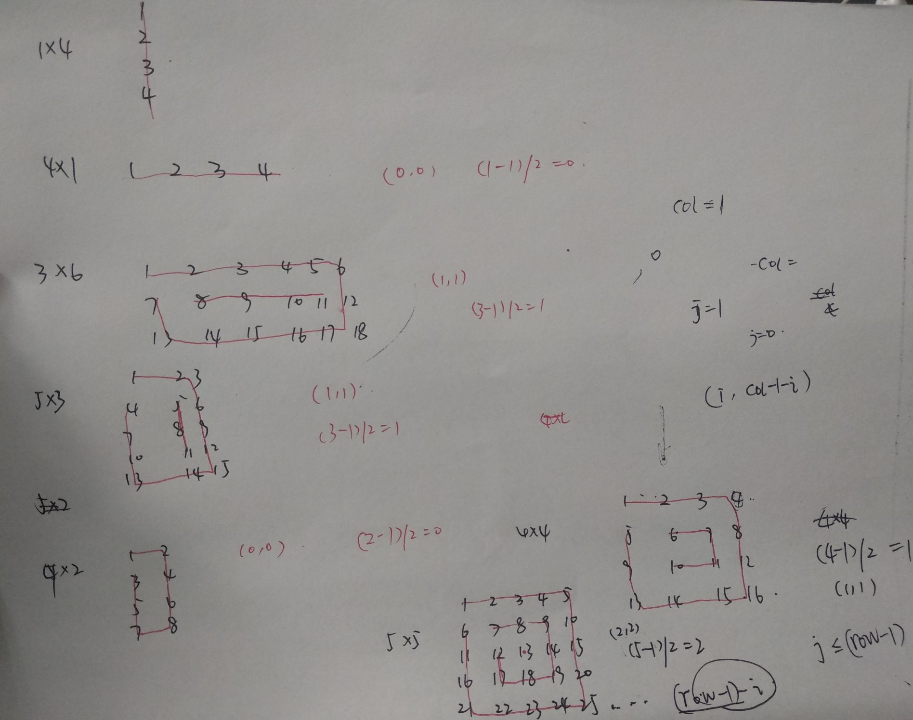

## 题目描述

输入一个矩阵，按照从外向里以顺时针的顺序依次打印出每一个数字，例如，如果输入如下4 X 4矩阵： 

1   2   3   4 
5   6   7   8 
 9  10 11 12 
13 14 15 16 

则依次打印出数字1,2,3,4,8,12,16,15,14,13,9,5,6,7,11,10. 

## 解题思路

这道题目刚开始看的时候，觉得好麻烦啊，然后就放在那不想写。

今天还是过来啃了啃/

### 思路一

首先通过观察要知道，假设一次顺时针打印一圈，也就是打印当前矩阵最外面一圈的数字。要打印第二圈的时候，起始点位置是(1, 1)。如果还能打第三圈，那么第三圈的起始位置是(2, 2)。假设矩阵的原始行数和列数分别为rows和cols。那么最后一圈的起点是多少呢？通过画图分析我们很容易知道。最后一圈的起点是 $(\frac{min(rows, cols)-1}{2}, \frac{min(rows, cols)-1}{2})$

要注意特殊的情况就是：



如上图所示，最后一圈的情况可能并不是完整的一圈，可能只是一个点，或者一行或者一列。

我的做法是，先假设是每一圈都是正常的，也就是4X4的矩阵。根据这种情况写好代码，然后将特殊情况代入程序，会发现比如说3X6的情况最后一圈那里，会将”8 9 10 11“打印完后，再打印一遍”11 10 9 8“；5X3的情况最后一圈会将”5 8 11“打印完后，再打印一遍。这时我就想，导致第二遍打印的原因是什么呢？

再第一种情况中，也就是打印完第一个行”8 9 10 11“之后，打印第一个”竖“的循环是正常的（此时不需要打印第一个”竖“），但是逆着打印第二个”行“的循环会生效，所有可以通过判断第一个竖的循环是否正常打印了，从而来决定接下来是否需要打印第二个”行“。

第二种情况中，打印完第一个竖的循环后，刚好是要结束的，第三个循环也就是第二个行循环不会被打印，但是到了最后一个逆着上的竖循环又被打印了，所以此时导致了重复。所有此时可以根据判断第三个循环也就是第二个逆着的行循环是否被打印，来决定接下来是否要进行最后一个逆着向上的竖循环。

```cpp
class Solution {
public:
    vector<int> printMatrix(vector<vector<int> > matrix) {
        int rows = matrix.size();
        if(rows==0) return {};
        int cols = matrix[0].size();
        vector<int> res;
        int rc = min(rows, cols);
        for(int i=0; i<=(rc-1)/2; i++){// 每一圈都是从(i, i)出发
            // 打印第一行
            for(int j=i; j<=cols-1-i; j++) res.push_back(matrix[i][j]);
            // 已经打印完了 (i, col-1-i)
            for(int j=i+1; j<=rows-1-i; j++) res.push_back(matrix[j][cols-1-i]);
            // 已经打印完了 (row-1-i, col-1-i)
            for(int j=cols-2-i; (i+1)<=rows-1-i && j>=i; j--) res.push_back(matrix[rows-1-i][j]);
            // 已经打印完了 (row-1-i, i)
            for(int j=rows-2-i; (cols-2-i)>=i && j>i; j--) res.push_back(matrix[j][i]);
        }
        return res;
    }
};
```

